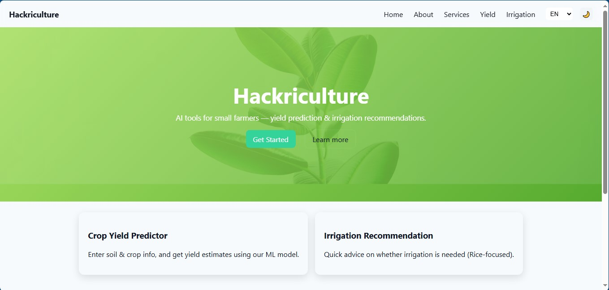

# ML_AURA
📝 **Description**
>**Hackiculture is a comprehensive web platform designed to empower farmers by bringing modern technology to their fingertips.
> Leveraging the power of data science, this application provides intelligent recommendations for crop selection and fertilizer usage, tailored to specific soil and climate conditions.**
>**Beyond recommendations, the platform serves as a vital tool for predicting crop diseases, allowing for timely intervention.
>It also acts as a one-stop information hub, offering real-time weather forecasts and details on beneficial government schemes.
>Our goal is to help farmers make informed, data-driven decisions to optimize their yields and enhance their agricultural practices through accessible technology.**

**✨ Features**

-📈 **crop yield prediction**: system that leverages historical data, real-time weather inputs, and soil parameters to forecast harvest outcomes with high accuracy.
-🌿 **Fertilizer Recommendation**: Suggests the appropriate amount of NPK (Nitrogen, Phosphorus, Potassium) fertilizers for your soil and selected crop.
-🌾 **Crop Information**: Provides a comprehensive database of various crops, offering valuable information for farmers.
-☀️ **Weather Information**: Gives access to real-time weather data and forecasts to help with agricultural planning.
-🎨 **Personalized Interface** – Intuitive, mobile-friendly UI for quick planning.
-🌎 **Global Reach** – Works for cities, trails, lakes, and more worldwide.
-**⚡ Fast Results** – Instant forecasts and visual risk indicators.

## 🖼️ Demo

| Live App | Screenshot |
|---------|------------|
| [**👉 Try apk**](https://hackriculture-updated.onrender.com/) |  |
